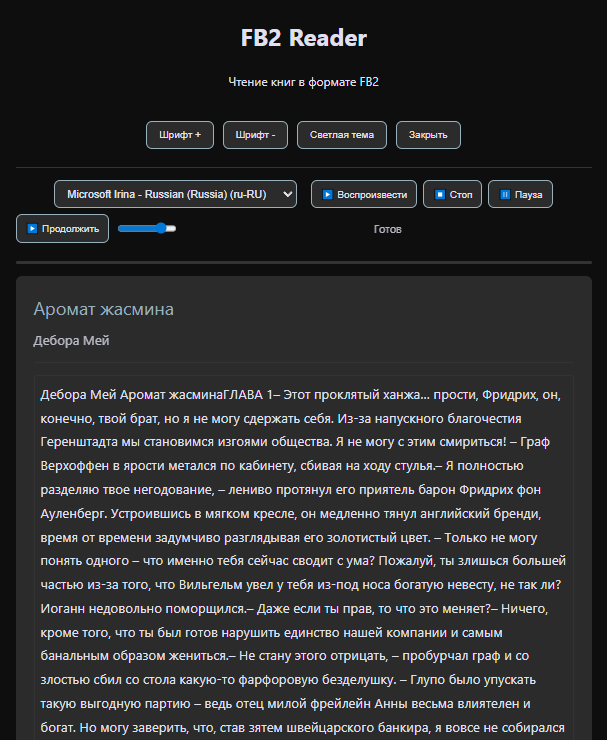
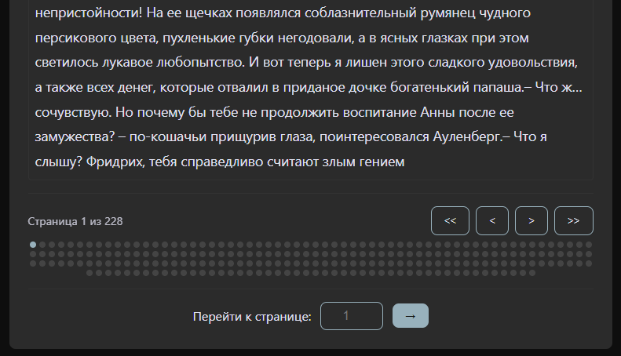

# 📚 FB2 Reader for Web — Простой, быстрый, без зависимостей

> Читайте книги в формате `.fb2` прямо в браузере — без установки, без регистрации, без сервера.

---

## ✨ Особенности

- ✅ **100% HTML/JS/CSS** — никаких npm, PHP, Node.js, сборщиков
- ✅ Поддержка **русского языка** и **кодировок** (UTF-8, Windows-1251)
- ✅ **Постраничный просмотр** с индикаторами
- ✅ **Переход по номеру страницы** — введите число и попадёте туда
- ✅ **TTS (речь)** — с выбором голоса 
- ✅ **Тёмная тема** — с поддержкой переключения
- ✅ **Адаптивный дизайн** — работает на телефоне, планшете, ПК
- ✅ **Работает офлайн** — просто открой HTML-файл в браузере

---

## 🚀 Как использовать

1. Скачай `fb2-reader-web.html`
2. Перетащи файл `.fb2` на страницу — или нажми "Выбрать файл"
3. Читай, перелистывай, вводи номер страницы внизу
4. Включи TTS — и слушай книгу вслух!

> 💡 Работает в **Chrome, Edge, Firefox, Safari** — на **Windows, macOS, Android, iOS**.

---

## 📱 Мобильный опыт

На телефоне поле ввода номера страницы стало **широким и центрированным**, кнопки — удобные для пальца.  
Работает даже на старых устройствах — никаких тяжёлых движков.

---

## 🛠️ Для разработчиков

- Проект **не требует сборки**
- Никаких внешних зависимостей
- Легко модифицировать — добавь свою логику, стили, голоса
- Используй как шаблон для других читалок (EPUB, TXT, etc.)

---

## 📜 Лицензия

MIT — можно использовать в любых целях, даже в коммерческих проектах.

---

## ❤️ Автор

Создано с любовью к читаемым книгам и чистому вебу.  
Если понравилось — поставь ⭐ звёздочку!

> *«Книги — не файлы. Это миры. А читалка должна быть удобной»*